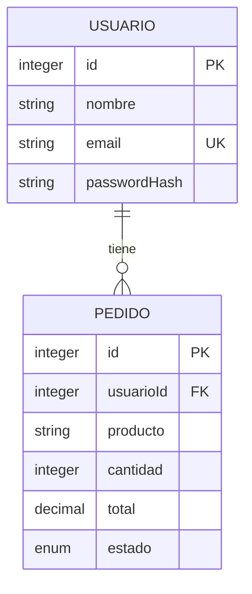

# API de usuarios y pedidos · Portafolio JavaScript

Backend de aprendizaje evolucionado hacia una API con autorización por propietario, persistencia relacional y pruebas automatizadas. Permite registrar una cuenta, autenticarse y gestionar sus pedidos y archivos privados.

**Estado:** fase 1 de mejora del backend. No hay frontend funcional ni despliegue público.

- API pública: **pendiente**.
- Frontend: **pendiente**.
- No hay pagos, inventario ni catálogo: producto y total son datos introducidos por el usuario.

## Tecnologías reales

JavaScript CommonJS, Node.js, Express 4, PostgreSQL, Sequelize 6, `pg`, `bcryptjs`, `jsonwebtoken`, Multer y dotenv. Nodemon para desarrollo. Pruebas con `node:test`, `assert` y HTTP mediante `fetch`; no se añadió un framework de tests externo.

El lockfile fija las dependencias. `pg-hstore` sigue declarado por compatibilidad con el proyecto original, pero no hay campos HSTORE. Entorno verificado: Node 24.20.0 y npm 11.19.0. El paquete conserva su declaración Node >=18; se recomienda utilizar el entorno verificado.

## Arquitectura

```text
Cliente HTTP → CORS → rutas → autenticación → autorización
                                  ↓
                            controllers
                                  ↓
                              services
                                  ↓
                   Sequelize + SQL parametrizado
                                  ↓
                             PostgreSQL
```

La validación de entradas ocurre antes de las consultas del recurso. La autenticación verifica JWT y la cuenta vigente. Las consultas de recursos incluyen al propietario.

`src/app.js` exporta Express sin abrir puerto ni sincronizar tablas. `src/server.js` administra el arranque local, comprueba conectividad y escucha `PORT`; `index.js` lo invoca. Los logs usan consola y un identificador de solicitud, sin cuerpos, tokens, contraseñas ni parámetros de consulta.

```text
src/
  app.js, server.js, seed.js
  config/        env.js y database.js
  controllers/   auth, usuarios y pedidos
  routes/        auth, usuarios, pedidos y archivos
  services/      usuarios, pedidos, transacción, SQL y almacenamiento
  middlewares/   JWT, propietario, CORS, límites, uploads, logs y errores
  models/        Usuario, Pedido y asociaciones
  utils/         validación, tokens, sanitización y AppError
migrations/      SQL inicial y condiciones de ejecución
scripts/        runner de migración y comprobación de sintaxis
test/          pruebas HTTP, modelos y configuración sin PostgreSQL real
postman/        colección JSON actual y material YAML histórico
public/         HTML informativo legado; uploads NO se sirven públicamente
.data/          archivos locales privados, ignorados por Git
```

## Instalación local

1. Clonar el repositorio y entrar en su directorio.
2. Instalar dependencias con `npm ci`.
3. Copiar `.env.example` a `.env` y configurar valores locales propios. No publicar ese archivo.
4. Definir manualmente un `JWT_SECRET` aleatorio de al menos 32 bytes. El valor de ejemplo se rechaza y la aplicación nunca genera la clave de firma al arrancar.
5. Preparar una **base nueva y vacía**, o revisar y autorizar por separado la adopción del esquema del curso.
6. Seguir [las instrucciones de migraciones](migrations/README.md). Arrancar NO crea tablas.
7. Ejecutar `npm run dev` o `npm start`.

La API local escucha el `PORT` configurado; el ejemplo utiliza 3000. `GET /health` informa del proceso, no del estado actual de PostgreSQL.

**Si ya tienes la base del curso:** no ejecutes la migración inicial ni el seed sobre ella. Se necesita revisar sus restricciones y preparar una adopción específica. Esta fase no conecta ni modifica esa base.

## Variables de entorno

| Variable | Uso |
|---|---|
| `NODE_ENV` | `development`, `test` o `production` |
| `PORT` | Puerto local; el futuro adaptador de despliegue puede usar directamente la app exportada |
| `DB_HOST`, `DB_PORT`, `DB_NAME`, `DB_USER`, `DB_PASSWORD` | Conexión por campos separados |
| `DATABASE_URL` | Alternativa PostgreSQL; sin parámetros de consulta ni fragmentos |
| `DB_SSL` | `true` exige TLS con verificación de certificado; obligatorio en producción |
| `DB_SSL_CA` | CA PEM del proveedor, opcional; admite saltos de línea o secuencias literales `\n` |
| `DB_POOL_MAX` | Máximo por instancia, 2 por defecto; permitido 1–10 |
| `JWT_SECRET` | Clave explícita de firma, privada; mínimo 32 bytes |
| `JWT_TTL_SECONDS` | Expiración, 3600 por defecto; entre 60 y 86400 |
| `CORS_ORIGINS` | Orígenes exactos separados por coma, sin rutas ni barra final |
| `LOGIN_RATE_LIMIT` | Intentos por IP/proceso cada 15 minutos, 10 por defecto |
| `REGISTRATION_RATE_LIMIT` | Registros simples/transaccionales por IP/proceso cada 15 minutos, 10 por defecto |
| `STORAGE_DRIVER` | `local` en desarrollo/test; `disabled` obligatorio en producción por ahora |

Los tests establecen configuración sintética, no leen `.env` y bloquean conexiones accidentales mediante el driver. Las variables de migración y seed están documentadas por separado; no deben habilitarse de forma rutinaria.

Para desarrollo, los orígenes predeterminados son `http://localhost:5500` y `http://127.0.0.1:5500`. Para el futuro Pages habrá que añadir su origen real HTTPS. No incluir el nombre del repositorio en CORS. Producción exige una lista explícita y rechaza `*`.

CORS permite GET, POST, PUT, DELETE y OPTIONS, con Content-Type y Authorization. Preflight responde 204 sin JWT. No se usan cookies ni se activa envío de credenciales cross-site. CORS no sustituye permisos ni impide solicitudes desde herramientas externas.

## PostgreSQL, Sequelize y SQL manual



Ambos modelos incluyen `createdAt` y `updatedAt`. El pedido exige propietario, cantidad positiva, total no negativo y estado pendiente/pagado/cancelado. El total se almacena como DECIMAL(12,2); puede serializarse como string para preservar precisión.

Se conserva SQL manual en `rawSqlService.js`, ejecutado con `sequelize.query` y parámetros `bind`. Usa el mismo pool que el ORM; ya no existe un segundo `pg.Pool`. Ambas variantes filtran por la identidad del token y excluyen hashes. Los listados aceptan `limit` (1–100, defecto 20) y `offset` (0–100000); el filtro `nombre` aplica a usuarios.

La creación conjunta de cuenta y primer pedido utiliza una transacción administrada: éxito implica COMMIT y cualquier error provoca ROLLBACK. El hash se calcula antes de abrir la transacción. La API ya no acepta `forzarError`; el rollback se prueba con fallos simulados. El borrado de cuenta y sus pedidos también es transaccional.

No se ejecuta `sequelize.sync`, ni force, ni alter desde el arranque o seed. La migración inicial añade FK, CHECK e índice de propietario; esas restricciones **no se aplicaron** a la base antigua. El runner registra checksum, bloquea concurrencia y rechaza esquemas existentes que no tengan su historial esperado. No hay comandos destructivos de reversión.

## Autenticación y autorización

El registro público crea cuentas nuevas. El login compara bcrypt (coste 10) y firma JWT HS256 con expiración, emisor y audiencia fijos. El token no incluye contraseña ni hash de bcrypt.

Cada solicitud privada verifica firma/claims y consulta la cuenta. El JWT contiene una versión de credencial derivada mediante HMAC: cambiar la contraseña invalida los tokens anteriores; eliminar la cuenta también invalida su acceso. No se añadió una columna de versión a la BD.

- **401:** falta token, es inválido/expirado o la cuenta/credencial ya no es vigente.
- **403:** intentar operar sobre otro ID de usuario o asignar un pedido a otra cuenta.
- **404:** pedido/archivo ausente o fuera del ámbito del propietario, para no revelar existencia.

No hay roles administrativos. El listado de usuarios devuelve únicamente la cuenta autenticada, conservando el formato array y la comparación ORM/SQL. Los pedidos pertenecen al token; `usuarioId` puede omitirse y, si se envía, debe coincidir. No se permite reasignarlo.

Las contraseñas nuevas requieren al menos 8 caracteres y un máximo de 72 bytes UTF-8, evitando truncamiento de bcrypt. El login mantiene compatibilidad con contraseñas antiguas más cortas. El email se recorta pero no cambia de mayúsculas/minúsculas: la normalización global de cuentas existentes queda pendiente.

## Endpoints

| Método | Ruta | Acceso / resultado |
|---|---|---|
| GET | `/` | Información JSON pública |
| GET | `/status`, `/health` | Estado de proceso, público |
| GET | `/public/info.html` | Página informativa legada |
| POST | `/login` | Público, limitado; 200 con token |
| POST | `/api/usuarios` | Registro público limitado; 201 |
| POST | `/api/usuarios/transaccion` | Registro de cuenta nueva y primer pedido; 201 |
| GET | `/api/usuarios` | JWT; solo cuenta propia |
| GET | `/api/usuarios/sql` | JWT; misma política mediante SQL |
| GET | `/api/usuarios/:id` | JWT y propietario |
| GET | `/api/usuarios/:id/detalles` | JWT y propietario, incluye pedidos |
| PUT | `/api/usuarios/:id` | JWT y propietario |
| DELETE | `/api/usuarios/:id` | JWT y propietario, borrado transaccional |
| GET | `/api/pedidos` | JWT; lista propia |
| POST | `/api/pedidos` | JWT; crea pedido propio, 201 |
| GET | `/api/pedidos/:id` | JWT; pedido propio |
| PUT | `/api/pedidos/:id` | JWT; pedido propio |
| DELETE | `/api/pedidos/:id` | JWT; pedido propio |
| POST | `/upload` | JWT, límite de solicitudes; 201 local / 503 con storage disabled |
| GET | `/api/archivos/:nombre` | JWT, solo archivo propio |
| OPTIONS | Rutas con Origin autorizado | Preflight CORS, 204 |

PUT conserva actualización parcial para mantener compatibilidad con el curso. No hay PATCH.

### Ejemplos ficticios

Registro `POST /api/usuarios`:

```json
{"nombre":"Cuenta Demo","email":"demo@example.invalid","password":"Solo-demo-2026"}
```

Login `POST /login` con email y password devuelve:

```json
{"status":"success","message":"Login correcto","data":{"token":"<JWT recibido en tiempo de ejecución>"}}
```

Para rutas privadas, enviar `Authorization: Bearer <token>`. Crear pedido con `POST /api/pedidos`:

```json
{"producto":"Teclado de demostración","cantidad":1,"total":"12.50","estado":"pendiente"}
```

Respuesta 201 ilustrativa; IDs y timestamps dependen de la ejecución:

```json
{"status":"success","message":"Pedido creado","data":{"id":1,"usuarioId":1,"producto":"Teclado de demostración","cantidad":1,"total":"12.50","estado":"pendiente"}}
```

La transacción recibe `{ "usuario": { ...datos de registro }, "pedido": { ...datos de pedido } }`. No acepta `usuarioId` ni `forzarError`.

Error 403:

```json
{"status":"error","message":"No tienes permiso sobre este recurso","data":null}
```

Además se utilizan 400 para entradas, 409 para duplicados, 413 para tamaño, 429 para límites, 500 genérico y 503 para almacenamiento aún no conectado. Los errores internos nunca devuelven stack, SQL ni credenciales.

## Multer y archivos privados

Enviar multipart/form-data con un único campo de archivo `archivo`. Máximo 2 MiB. Se verifica extensión, MIME declarado y firma/estructura mínima PNG o JPEG; el nombre final es UUID generado por la app. Se rechazan campos adicionales.

Multer recibe en memoria y delega a `storageService`. En desarrollo, el adaptador guarda bajo `.data/uploads/<propietario>/`, fuera de los estáticos y de Git. La descarga requiere Bearer y busca exclusivamente en el directorio del dueño. Un archivo ajeno responde 404. No colocar archivos nuevos en `public/uploads`: ya no se sirven.

En producción `STORAGE_DRIVER=disabled`: upload y descarga privada responden 503 hasta integrar un adaptador de objetos. No hay URLs ni proveedor de producción inventados.

**Limitaciones:** la inspección binaria no es una decodificación completa, recodificación ni antivirus. Hay límite de 20 subidas por IP/proceso cada 15 minutos, pero no cuota total de almacenamiento. Aún falta eliminar archivos al cerrar una cuenta, retención, metadatos en BD y limpieza de huérfanos. Una cuenta borrada pierde acceso, aunque sus archivos locales permanezcan para limpieza posterior. No habilitar este adaptador como almacenamiento público de producción.

## Scripts y pruebas

| Comando | Efecto |
|---|---|
| `npm start` | Comprueba conexión e inicia HTTP; no crea tablas |
| `npm run dev` | Lo mismo con nodemon |
| `npm run check` | Sintaxis de todos los JS propios en src/scripts/test e index |
| `npm test` | Tests automatizados aislados |
| `npm run db:migrate` | Solo base nueva/vacía explícitamente autorizada; ver migrations/README.md |
| `npm run seed` | Datos sintéticos opcionales; protegido, no forma parte del arranque |

Las pruebas ejercitan HTTP real contra Express en puerto efímero, con modelos simulados. Cubren login, JWT, expiración/algoritmo, propiedad, CRUD, inputs, errores, CORS, archivos, límites, revocación y transacciones simuladas. También validan modelos reales en memoria y el runner de migración con una conexión simulada.

No leen datos reales ni ejecutan DDL en PostgreSQL. Los archivos de prueba son sintéticos y se eliminan del directorio temporal. **No prueban atomicidad real, compatibilidad del esquema legado ni conectividad PostgreSQL**: esa integración queda pendiente de una base desechable autorizada.

## Postman y evidencias

Importar `postman/Modulo7.postman_collection.json`: es la colección actual de esta fase. Configurar variables locales `baseUrl`, `email` y `password` con una cuenta de demostración en una BD de pruebas. El login guarda token e ID en variables locales del entorno seleccionado. Nunca exportar ni compartir un entorno que contenga tokens o claves.

Las carpetas YAML originales en `postman/collections/` se conservan únicamente como material histórico del curso: no son la colección actual y contienen ejemplos de autenticación/transacciones anteriores. No ejecutarlas como runner. La colección JSON sí refleja los endpoints actuales e incluye comprobaciones de estado.

Postman es manual y puede escribir datos. No ejecutar toda la colección contra una base real. Las eliminaciones están marcadas al final y requieren revisión.

Las capturas restantes son evidencia histórica, no demuestran el comportamiento de esta fase. Se retiraron dos capturas sensibles y los logs versionados; no se reescribió el historial. Las contraseñas de ejemplos son ficticias y no deben reutilizarse. No hay evidencia nueva de despliegue ni de BD real.

## Seguridad y decisiones pendientes

- Credencial PostgreSQL expuesta en una captura histórica: **debe rotarse**, aunque la imagen ya no esté en el árbol actual. También revisar reutilización. Su valor no se reproduce.
- El historial conserva la captura y otra con hashes: la limpieza histórica requiere aprobación separada.
- La política es exclusivamente por propietario. No hay recuperación de contraseña, roles ni refresh tokens.
- Los limitadores son en memoria por proceso; para varias instancias se necesita estado compartido y una política de proxy verificada. No se confía ciegamente en X-Forwarded-For.
- Los listados están paginados. Las validaciones complementan, pero no sustituyen, restricciones reales de BD.
- La auditoría npm anterior no pudo consultar el registro; no se afirma ausencia de vulnerabilidades. Esta fase no cambia versiones ni instala dependencias nuevas.
- No hay garantías de disponibilidad, backups o monitoreo de producción todavía.

## Futura arquitectura de despliegue

```text
GitHub Pages (frontend estático, pendiente)
          ↓ HTTPS + JSON + JWT
Vercel (Express exportado, pendiente)
          ├── PostgreSQL externo con TLS y pooling
          └── Almacenamiento de objetos autenticado (pendiente)
```

Antes de desplegar: construir frontend/configuración pública de API, definir origen real, configurar secretos separados por entorno, verificar proxy y límite distribuido, elegir región/proveedor y pooling compatible, probar migraciones en una BD nueva autorizada, conectar almacenamiento de objetos y comprobar el flujo completo. No incluir credenciales en el frontend.

No se añadió configuración de Vercel en esta fase. El contrato save/read permite evolucionar el almacenamiento sin reescribir los controllers. La plataforma elegida deberá verificarse para límites de payload, duración y conexiones.

## Contexto de aprendizaje

Proyecto originado en los módulos 6, 7 y 8 del curso Full Stack JavaScript. Esta fase conserva Express, PostgreSQL, Sequelize, SQL manual, bcrypt, JWT, Multer y la organización por capas, reforzando permisos y reproducibilidad.

Autor: propietario del repositorio. Licencia: pendiente de elección; no se añadió una licencia por defecto.
