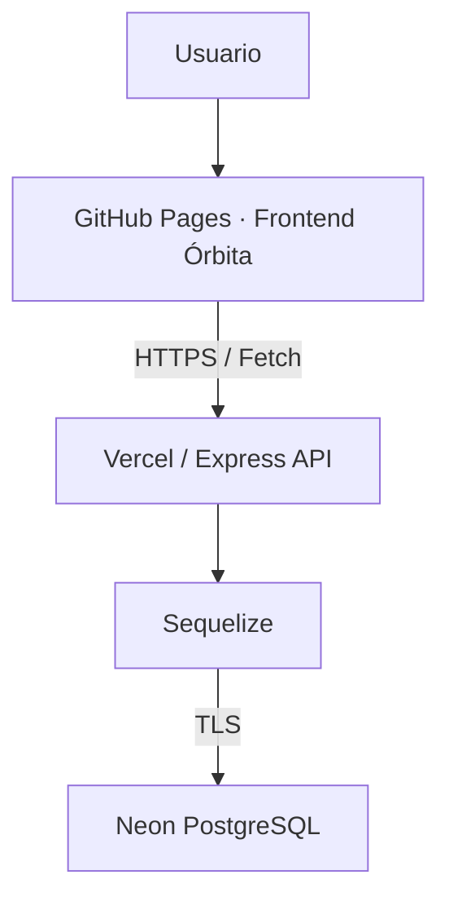
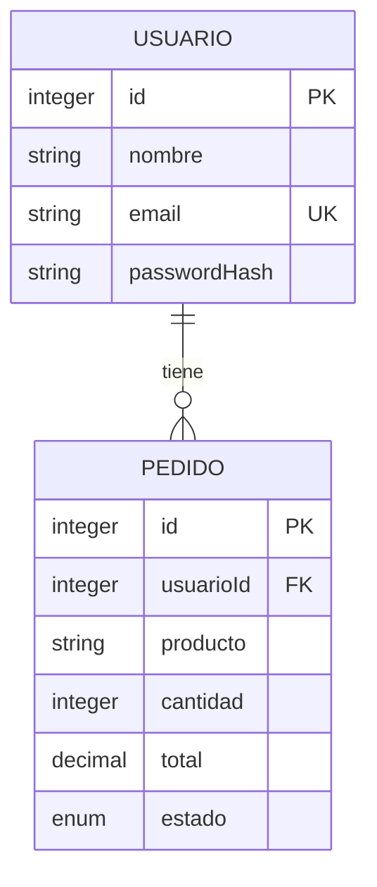

# Órbita · Full Stack JavaScript

Aplicación web para organizar pedidos personales, con una interfaz responsive, autenticación JWT y persistencia relacional. Proyecto de portafolio desarrollado desde ejercicios de los módulos 6, 7 y 8 hasta una aplicación desplegada de punta a punta, con autorización por propietario y pruebas automatizadas.

[🌐 Demo](https://orijimenezv.github.io/Proyecto-Modulos-6-7-y-8/) · [⚙️ API](https://proyecto-modulos-6-7-8-api.vercel.app) · [💻 Código](https://github.com/orijimenezv/Proyecto-Modulos-6-7-y-8)

**Estado: EN PRODUCCIÓN.** Registro, login JWT, rutas protegidas y CRUD completo de pedidos probados manualmente en producción. **58 pruebas automatizadas aprobadas**, ejecutadas con datos y conexiones simulados.

## Proyecto en producción

| Componente | Plataforma |
|---|---|
| Frontend estático Órbita | GitHub Pages |
| API Node.js / Express | Vercel |
| Base de datos PostgreSQL | Neon |

GitHub Actions publica exclusivamente `frontend/` en Pages, sin build. El navegador se comunica con la API mediante HTTPS; solo el backend accede a PostgreSQL.

Para explorar la aplicación, crea tu propia cuenta desde la demo. Las operaciones de registro y pedidos guardan datos reales. Los estados pendiente, pagado y cancelado son etiquetas de organización: la aplicación no procesa pagos. Producto e importe son datos introducidos por el usuario; no hay catálogo ni inventario.

## Funcionalidades

- Registro de usuarios e inicio de sesión con JWT Bearer.
- Sesión de navegador en `sessionStorage`, cierre de sesión y retorno al login ante un 401.
- Dashboard con saludo al usuario y vista de sus pedidos.
- Crear, listar, editar y eliminar pedidos, con confirmación antes del borrado.
- Paginación y actualización del listado.
- Recursos aislados por usuario mediante autorización por propietario en la API.
- Validación de formularios, cantidades, importes y estados.
- Manejo de errores, mensajes de carga y controles bloqueados durante las solicitudes.
- Diseño responsive, HTML semántico, labels y foco visible.

## Stack tecnológico

| Área | Tecnologías |
|---|---|
| Frontend | HTML5, CSS3, JavaScript vanilla, Fetch API, sessionStorage; sin framework ni build |
| Backend | Node.js, Express, Sequelize, JWT (`jsonwebtoken`), bcryptjs, Multer |
| Base de datos | PostgreSQL alojado en Neon; driver `pg` |
| Deploy | GitHub Pages, GitHub Actions y Vercel |
| Testing | `node:test`, `node:assert/strict` y pruebas HTTP contra Express |

Multer forma parte del backend para archivos privados en desarrollo; el almacenamiento de archivos está deshabilitado en producción y no forma parte del flujo del frontend.

## Arquitectura



## Seguridad implementada

- Contraseñas hasheadas con bcryptjs; no se devuelven hashes al cliente.
- JWT con expiración y validación de firma, emisor y audiencia.
- Autorización por propietario y consultas limitadas al usuario autenticado.
- Validación de entradas y consultas SQL parametrizadas.
- CORS con orígenes explícitos; el origen de GitHub Pages está autorizado.
- Rate limiting por IP y proceso; todavía no es un límite distribuido entre instancias.
- Secretos mediante variables de entorno del backend y TLS verificado hacia PostgreSQL.
- JWT exclusivamente en `sessionStorage`, nunca en `localStorage`. Esto limita su persistencia, pero no lo protege de un posible XSS.
- Datos de la API representados con `textContent`; errores HTTP sin detalles internos ni secretos.

## Lo que aprendí

Evolucioné ejercicios de los módulos hacia una aplicación completa, conectando una interfaz vanilla con una API y una base relacional. Aprendí a separar autenticación de autorización, aplicar propiedad de recursos, trabajar con transacciones y probar errores sin tocar datos reales. El despliegue me permitió resolver la integración de CORS, el driver PostgreSQL en Vercel, TLS y la publicación de archivos estáticos mediante GitHub Actions.

## Documentación técnica

### Dependencias y entorno

JavaScript CommonJS, Node.js, Express 4, PostgreSQL, Sequelize 6, `pg`, `bcryptjs`, `jsonwebtoken`, Multer y dotenv. Nodemon para desarrollo. Pruebas con `node:test`, `assert` y HTTP mediante `fetch`; no se añadió un framework de tests externo.

El lockfile fija las dependencias. `pg-hstore` sigue declarado por compatibilidad con el proyecto original, pero no hay campos HSTORE. Entorno verificado: Node 24.20.0 y npm 11.19.0. El paquete conserva su declaración Node >=18; se recomienda utilizar el entorno verificado.

### Organización interna

```text
Cliente HTTP → CORS → rutas → autenticación → autorización
                                  ↓
                            controllers
                                  ↓
                              services
                                  ↓
                   Sequelize + SQL parametrizado
                                  ↓
                             PostgreSQL
```

La validación de entradas ocurre antes de las consultas del recurso. La autenticación verifica JWT y la cuenta vigente. Las consultas de recursos incluyen al propietario.

`src/app.js` exporta Express sin abrir puerto ni sincronizar tablas. `src/server.js` administra el arranque local, comprueba conectividad y escucha `PORT`; `index.js` lo invoca. Los logs usan consola y un identificador de solicitud, sin cuerpos, tokens, contraseñas ni parámetros de consulta.

```text
frontend/       HTML, CSS y módulos JavaScript del cliente
.github/workflows/pages.yml  Publicación de frontend/ en GitHub Pages
src/
  app.js, server.js, seed.js
  config/        env.js y database.js
  controllers/   auth, usuarios y pedidos
  routes/        auth, usuarios, pedidos y archivos
  services/      usuarios, pedidos, transacción, SQL y almacenamiento
  middlewares/   JWT, propietario, CORS, límites, uploads, logs y errores
  models/        Usuario, Pedido y asociaciones
  utils/         validación, tokens, sanitización y AppError
migrations/      SQL inicial y condiciones de ejecución
scripts/        runner de migración y comprobación de sintaxis
test/          pruebas HTTP, modelos y configuración sin PostgreSQL real
postman/        colección JSON actual y material YAML histórico
public/         HTML informativo legado; uploads NO se sirven públicamente
.data/          archivos locales privados, ignorados por Git
```

## Instalación local

### Frontend Órbita

Aplicación HTML/CSS/JavaScript vanilla, sin build ni dependencias de interfaz. Incluye registro, login, sesión en `sessionStorage`, perfil y CRUD de pedidos paginado. La sesión se borra al cerrar sesión o recibir 401. Los importes se muestran sin símbolo monetario porque la API no define moneda.

Después de `npm ci`, servir **solo** la carpeta `frontend/` desde la raíz del repositorio (no se importa ni inicia el backend):

```sh
node -e "const express=require('express');const app=express();app.use(express.static('frontend'));app.listen(5500,'127.0.0.1',()=>console.log('http://127.0.0.1:5500'));"
```

Abrir `http://127.0.0.1:5500`. No usar `file://`. La URL pública de la API está centralizada en `frontend/js/config.js`; la política `connect-src` de `frontend/index.html` también debe coincidir si se cambia el destino. Son configuraciones públicas: nunca poner secretos en estos archivos. Todos los recursos usan rutas relativas para funcionar bajo el subdirectorio de GitHub Pages.

**CORS verificado:** la API responde 204 al preflight del origen `https://orijimenezv.github.io`, pero responde 403 para `http://127.0.0.1:5500`. La portada funciona localmente; el flujo real desde ese origen necesita una autorización CORS independiente o un entorno de pruebas permitido. Las comprobaciones automatizadas de interfaz usan respuestas simuladas y no escriben en producción; el flujo real desde Pages también se probó manualmente. Registrar o modificar pedidos desde la interfaz contra la API real sí escribe datos.

Arquitectura: **GitHub Pages (frontend estático) → Vercel (API Express) → Neon (PostgreSQL)**. El navegador solo llama a la API mediante `fetch`; nunca se conecta a PostgreSQL. El workflow `.github/workflows/pages.yml` publica esta carpeta por separado, sin modificar las rutas del backend.

### Backend

1. Clonar el repositorio y entrar en su directorio.
2. Instalar dependencias con `npm ci`.
3. Copiar `.env.example` a `.env` y configurar valores locales propios. No publicar ese archivo.
4. Definir manualmente un `JWT_SECRET` aleatorio de al menos 32 bytes. El valor de ejemplo se rechaza y la aplicación nunca genera la clave de firma al arrancar.
5. Preparar una **base nueva y vacía**, o revisar y autorizar por separado la adopción del esquema del curso.
6. Seguir [las instrucciones de migraciones](migrations/README.md). Arrancar NO crea tablas.
7. Ejecutar `npm run dev` o `npm start`.

La API local escucha el `PORT` configurado; el ejemplo utiliza 3000. `GET /health` informa del proceso, no del estado actual de PostgreSQL.

**Si ya tienes la base del curso:** no ejecutes la migración inicial ni el seed sobre ella. Se necesita revisar sus restricciones y preparar una adopción específica. La base histórica del curso requiere una revisión independiente del entorno de producción en Neon.

## Variables de entorno

| Variable | Uso |
|---|---|
| `NODE_ENV` | `development`, `test` o `production` |
| `PORT` | Puerto del arranque local; Vercel utiliza la integración de Express |
| `DB_HOST`, `DB_PORT`, `DB_NAME`, `DB_USER`, `DB_PASSWORD` | Conexión por campos separados |
| `DATABASE_URL` | Alternativa PostgreSQL; admite `sslmode=require/verify-full` y `connect_timeout=1..60`; sin fragmentos |
| `DB_SSL` | `true` exige TLS verificado; producción exige esto o un `sslmode` seguro. `false` contradice un `sslmode` seguro y se rechaza |
| `DB_SSL_CA` | CA PEM del proveedor, opcional; admite saltos de línea o secuencias literales `\n` |
| `DB_POOL_MAX` | Máximo por instancia, 2 por defecto; permitido 1–10 |
| `JWT_SECRET` | Clave explícita de firma, privada; mínimo 32 bytes |
| `JWT_TTL_SECONDS` | Expiración, 3600 por defecto; entre 60 y 86400 |
| `CORS_ORIGINS` | Orígenes exactos separados por coma, sin rutas ni barra final |
| `LOGIN_RATE_LIMIT` | Intentos por IP/proceso cada 15 minutos, 10 por defecto |
| `REGISTRATION_RATE_LIMIT` | Registros simples/transaccionales por IP/proceso cada 15 minutos, 10 por defecto |
| `STORAGE_DRIVER` | `local` en desarrollo/test; `disabled` obligatorio en producción por ahora |

Los tests establecen configuración sintética, no leen `.env` y bloquean conexiones accidentales mediante el driver. Las variables de migración y seed están documentadas por separado; no deben habilitarse de forma rutinaria.

### DATABASE_URL y TLS para PostgreSQL externo

La URL se valida y convierte en campos separados antes de construir Sequelize. Solo se admiten protocolos `postgres:`/`postgresql:`, parámetros conocidos sin duplicados y una conexión completa. `connect_timeout` se convierte de segundos a `connectionTimeoutMillis` (por defecto 10 segundos). Nunca se registra la URL ni se incluye su contenido en errores.

Decisión verificada en Sequelize 6.37.8 y pg 8.23.0: sus parsers de URI pueden sobrescribir `dialectOptions.ssl`. Por eso no se entrega la URI al ORM/driver. `require` y `verify-full` activan siempre `rejectUnauthorized: true`, conservando la verificación de hostname de Node; no se reproduce el modo de libpq que cifra sin verificar el certificado. Se rechazan modos débiles y otros overrides TLS. `DB_SSL_CA` permite configurar una CA de confianza explícita. Los campos `DB_*` siguen disponibles para desarrollo local.

Una URL estilo Neon con `sslmode=require` es compatible. **`channel_binding=require` se rechaza explícitamente:** Sequelize no transmite `enableChannelBinding` y pg ofrece negociación opcional, sin garantizar la exigencia estricta de libpq. No se ignora ni se rebaja esa política. Si channel binding obligatorio es requisito del servicio, esta integración necesita una adaptación adicional antes de conectarse; no basta con quitar el parámetro. La conexión con Neon funciona en producción con la configuración admitida. Esta limitación de channel binding sigue vigente.

Para desarrollo, los orígenes predeterminados son `http://localhost:5500` y `http://127.0.0.1:5500`. En producción está autorizado `https://orijimenezv.github.io`. No incluir el nombre del repositorio en CORS. Producción exige una lista explícita y rechaza `*`.

CORS permite GET, POST, PUT, DELETE y OPTIONS, con Content-Type y Authorization. Preflight responde 204 sin JWT. No se usan cookies ni se activa envío de credenciales cross-site. CORS no sustituye permisos ni impide solicitudes desde herramientas externas.

## PostgreSQL, Sequelize y SQL manual



Ambos modelos incluyen `createdAt` y `updatedAt`. El pedido exige propietario, cantidad positiva, total no negativo y estado pendiente/pagado/cancelado. El total se almacena como DECIMAL(12,2); puede serializarse como string para preservar precisión.

Se conserva SQL manual en `rawSqlService.js`, ejecutado con `sequelize.query` y parámetros `bind`. Usa el mismo pool que el ORM; ya no existe un segundo `pg.Pool`. Ambas variantes filtran por la identidad del token y excluyen hashes. Los listados aceptan `limit` (1–100, defecto 20) y `offset` (0–100000); el filtro `nombre` aplica a usuarios.

La creación conjunta de cuenta y primer pedido utiliza una transacción administrada: éxito implica COMMIT y cualquier error provoca ROLLBACK. El hash se calcula antes de abrir la transacción. La API ya no acepta `forzarError`; el rollback se prueba con fallos simulados. El borrado de cuenta y sus pedidos también es transaccional.

No se ejecuta `sequelize.sync`, ni force, ni alter desde el arranque o seed. La migración inicial añade FK, CHECK e índice de propietario; Neon cuenta con el esquema migrado. La adopción de una base antigua del curso debe revisarse por separado. El runner registra checksum, bloquea concurrencia y rechaza esquemas existentes que no tengan su historial esperado. No hay comandos destructivos de reversión.

## Autenticación y autorización

El registro público crea cuentas nuevas. El login compara bcrypt (coste 10) y firma JWT HS256 con expiración, emisor y audiencia fijos. El token no incluye contraseña ni hash de bcrypt.

Cada solicitud privada verifica firma/claims y consulta la cuenta. El JWT contiene una versión de credencial derivada mediante HMAC: cambiar la contraseña invalida los tokens anteriores; eliminar la cuenta también invalida su acceso. No se añadió una columna de versión a la BD.

- **401:** falta token, es inválido/expirado o la cuenta/credencial ya no es vigente.
- **403:** intentar operar sobre otro ID de usuario o asignar un pedido a otra cuenta.
- **404:** pedido/archivo ausente o fuera del ámbito del propietario, para no revelar existencia.

No hay roles administrativos. El listado de usuarios devuelve únicamente la cuenta autenticada, conservando el formato array y la comparación ORM/SQL. Los pedidos pertenecen al token; `usuarioId` puede omitirse y, si se envía, debe coincidir. No se permite reasignarlo.

Las contraseñas nuevas requieren al menos 8 caracteres y un máximo de 72 bytes UTF-8, evitando truncamiento de bcrypt. El login mantiene compatibilidad con contraseñas antiguas más cortas. El email se recorta pero no cambia de mayúsculas/minúsculas: la normalización global de cuentas existentes queda pendiente.

## Endpoints

| Método | Ruta | Acceso / resultado |
|---|---|---|
| GET | `/` | Información JSON pública |
| GET | `/status`, `/health` | Estado de proceso, público |
| GET | `/public/info.html` | Página informativa legada |
| POST | `/login` | Público, limitado; 200 con token |
| POST | `/api/usuarios` | Registro público limitado; 201 |
| POST | `/api/usuarios/transaccion` | Registro de cuenta nueva y primer pedido; 201 |
| GET | `/api/usuarios` | JWT; solo cuenta propia |
| GET | `/api/usuarios/sql` | JWT; misma política mediante SQL |
| GET | `/api/usuarios/:id` | JWT y propietario |
| GET | `/api/usuarios/:id/detalles` | JWT y propietario, incluye pedidos |
| PUT | `/api/usuarios/:id` | JWT y propietario |
| DELETE | `/api/usuarios/:id` | JWT y propietario, borrado transaccional |
| GET | `/api/pedidos` | JWT; lista propia |
| POST | `/api/pedidos` | JWT; crea pedido propio, 201 |
| GET | `/api/pedidos/:id` | JWT; pedido propio |
| PUT | `/api/pedidos/:id` | JWT; pedido propio |
| DELETE | `/api/pedidos/:id` | JWT; pedido propio |
| POST | `/upload` | JWT, límite de solicitudes; 201 local / 503 con storage disabled |
| GET | `/api/archivos/:nombre` | JWT, solo archivo propio |
| OPTIONS | Rutas con Origin autorizado | Preflight CORS, 204 |

PUT conserva actualización parcial para mantener compatibilidad con el curso. No hay PATCH.

### Ejemplos ficticios

Registro `POST /api/usuarios`:

```json
{"nombre":"Cuenta Demo","email":"demo@example.invalid","password":"Solo-demo-2026"}
```

Login `POST /login` con email y password devuelve:

```json
{"status":"success","message":"Login correcto","data":{"token":"<JWT recibido en tiempo de ejecución>"}}
```

Para rutas privadas, enviar `Authorization: Bearer <token>`. Crear pedido con `POST /api/pedidos`:

```json
{"producto":"Teclado de demostración","cantidad":1,"total":"12.50","estado":"pendiente"}
```

Respuesta 201 ilustrativa; IDs y timestamps dependen de la ejecución:

```json
{"status":"success","message":"Pedido creado","data":{"id":1,"usuarioId":1,"producto":"Teclado de demostración","cantidad":1,"total":"12.50","estado":"pendiente"}}
```

La transacción recibe `{ "usuario": { ...datos de registro }, "pedido": { ...datos de pedido } }`. No acepta `usuarioId` ni `forzarError`.

Error 403:

```json
{"status":"error","message":"No tienes permiso sobre este recurso","data":null}
```

Además se utilizan 400 para entradas, 409 para duplicados, 413 para tamaño, 429 para límites, 500 genérico y 503 para almacenamiento aún no conectado. Los errores internos nunca devuelven stack, SQL ni credenciales.

## Multer y archivos privados

Enviar multipart/form-data con un único campo de archivo `archivo`. Máximo 2 MiB. Se verifica extensión, MIME declarado y firma/estructura mínima PNG o JPEG; el nombre final es UUID generado por la app. Se rechazan campos adicionales.

Multer recibe en memoria y delega a `storageService`. En desarrollo, el adaptador guarda bajo `.data/uploads/<propietario>/`, fuera de los estáticos y de Git. La descarga requiere Bearer y busca exclusivamente en el directorio del dueño. Un archivo ajeno responde 404. No colocar archivos nuevos en `public/uploads`: ya no se sirven.

En producción `STORAGE_DRIVER=disabled`: upload y descarga privada responden 503 hasta integrar un adaptador de objetos. No hay URLs ni proveedor de producción inventados.

**Limitaciones:** la inspección binaria no es una decodificación completa, recodificación ni antivirus. Hay límite de 20 subidas por IP/proceso cada 15 minutos, pero no cuota total de almacenamiento. Aún falta eliminar archivos al cerrar una cuenta, retención, metadatos en BD y limpieza de huérfanos. Una cuenta borrada pierde acceso, aunque sus archivos locales permanezcan para limpieza posterior. No habilitar este adaptador como almacenamiento público de producción.

## Scripts y pruebas

| Comando | Efecto |
|---|---|
| `npm start` | Comprueba conexión e inicia HTTP; no crea tablas |
| `npm run dev` | Lo mismo con nodemon |
| `npm run check` | Sintaxis de todos los JS propios en src/scripts/test/frontend/js e index |
| `npm test` | Tests automatizados aislados |
| `npm run db:migrate` | Solo base nueva/vacía explícitamente autorizada; ver migrations/README.md |
| `npm run seed` | Datos sintéticos opcionales; protegido, no forma parte del arranque |

**58 pruebas automatizadas aprobadas.** Las pruebas ejercitan HTTP real contra Express en puerto efímero, con modelos simulados. Cubren login, JWT, expiración/algoritmo, propiedad, CRUD, inputs, errores, CORS, archivos, límites, revocación y transacciones simuladas. También validan modelos reales en memoria, el runner de migración con una conexión simulada y el cliente frontend: Bearer, sessionStorage, cierre ante 401, validaciones y métodos del CRUD.

No leen datos reales ni ejecutan DDL en PostgreSQL. Los archivos de prueba son sintéticos y se eliminan del directorio temporal. **No prueban atomicidad real, compatibilidad del esquema legado ni conectividad PostgreSQL**: agregar pruebas automatizadas de integración sobre una base desechable sigue pendiente. Por separado, se verificaron manualmente en producción el registro, login JWT, rutas protegidas y CRUD completo de pedidos con Neon.

## Postman y evidencias

Importar `postman/Modulo7.postman_collection.json`: es la colección de referencia de la API. Configurar variables locales `baseUrl`, `email` y `password` con una cuenta de demostración en una BD de pruebas. El login guarda token e ID en variables locales del entorno seleccionado. Nunca exportar ni compartir un entorno que contenga tokens o claves.

Las carpetas YAML originales en `postman/collections/` se conservan únicamente como material histórico del curso: no son la colección actual y contienen ejemplos de autenticación/transacciones anteriores. No ejecutarlas como runner. La colección JSON sí refleja los endpoints actuales e incluye comprobaciones de estado.

Postman es manual y puede escribir datos. No ejecutar toda la colección contra una base real. Las eliminaciones están marcadas al final y requieren revisión.

Las capturas restantes son material histórico del curso, no evidencia del comportamiento actual. Se retiraron dos capturas sensibles y los logs versionados; las dos imágenes también se eliminaron del historial publicado. La credencial expuesta fue rotada. Los ejemplos de contraseñas son ficticios y no deben reutilizarse. La demo y el historial de GitHub Actions permiten consultar el despliegue actual; los flujos de producción fueron comprobados manualmente.

## Seguridad y decisiones pendientes

- La política es exclusivamente por propietario. No hay recuperación de contraseña, roles ni refresh tokens.
- Los limitadores son en memoria por proceso; para varias instancias se necesita estado compartido y una política de proxy verificada. No se confía ciegamente en X-Forwarded-For.
- Los listados están paginados. Las validaciones complementan, pero no sustituyen, restricciones reales de BD.
- Las pruebas funcionales no sustituyen una auditoría de dependencias; no se afirma ausencia de vulnerabilidades.
- No hay garantías de disponibilidad, backups o monitoreo de producción todavía.

## Operación y despliegue

El frontend está publicado en GitHub Pages, la API en Vercel y PostgreSQL en Neon. Registro, login, rutas protegidas y CRUD de pedidos funcionan en producción.

El workflow [pages.yml](.github/workflows/pages.yml) se ejecuta al hacer push a `main` cuando cambia `frontend/**` o el propio workflow, y permite ejecución manual limitada a `main`. Usa checkout, configure-pages, upload-pages-artifact y deploy-pages; sube únicamente `./frontend`, con `index.html` en la raíz del artifact. No necesita build ni una rama `gh-pages`. Configura permisos de lectura del contenido y publicación de Pages, concurrencia y el environment `github-pages` con la URL del deployment.

Vercel ejecuta la API Express. `src/app.js` exporta la aplicación y `src/server.js` conserva el arranque local. Sequelize recibe el módulo `pg` explícitamente mediante `dialectModule`, evitando depender de su carga dinámica en el bundle. No se necesita un archivo `vercel.json` en la configuración actual.

Las variables privadas se configuran por entorno en el backend: conexión PostgreSQL, clave de firma JWT y orígenes CORS. Producción exige TLS, una lista explícita de orígenes HTTPS y `STORAGE_DRIVER=disabled`. Nunca deben copiarse secretos al frontend, al README ni al artifact de Pages.

El pool es pequeño por instancia; su tamaño debe revisarse según concurrencia y límites del proveedor. Las migraciones son una operación separada del arranque y del despliegue estático. El almacenamiento persistente de archivos, los límites distribuidos y las pruebas automatizadas con una base desechable son mejoras pendientes, no capacidades actuales.

## Contexto de aprendizaje

Proyecto originado en los módulos 6, 7 y 8 del curso Full Stack JavaScript. Integra frontend vanilla, Express, PostgreSQL, Sequelize, SQL manual, bcryptjs, JWT y una organización por capas, con énfasis en permisos, pruebas y despliegue reproducible.

Autor: propietario del repositorio. Licencia: pendiente de elección; no se añadió una licencia por defecto.
